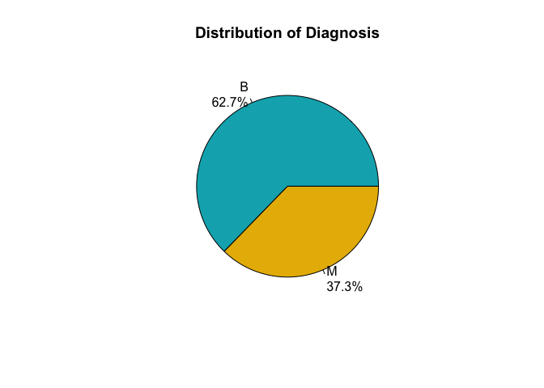
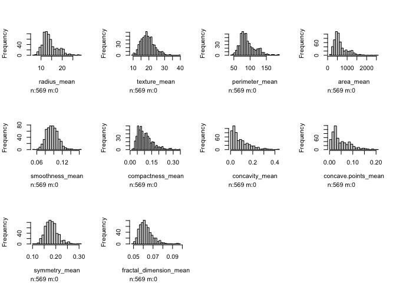
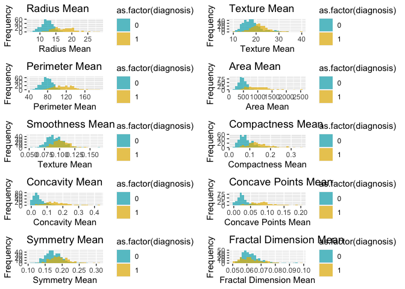
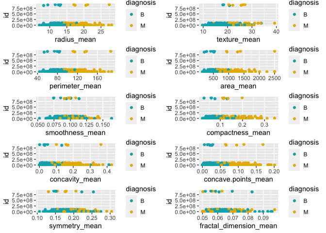
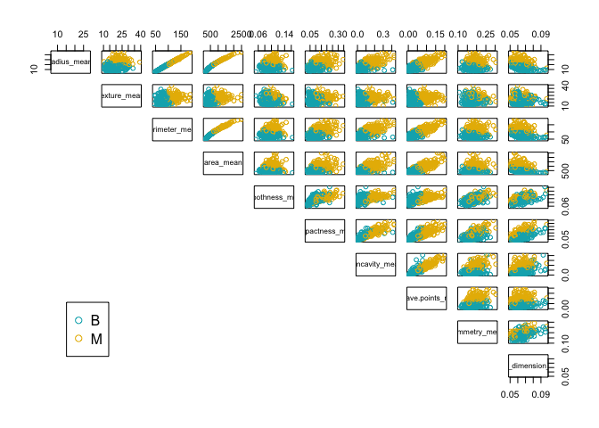
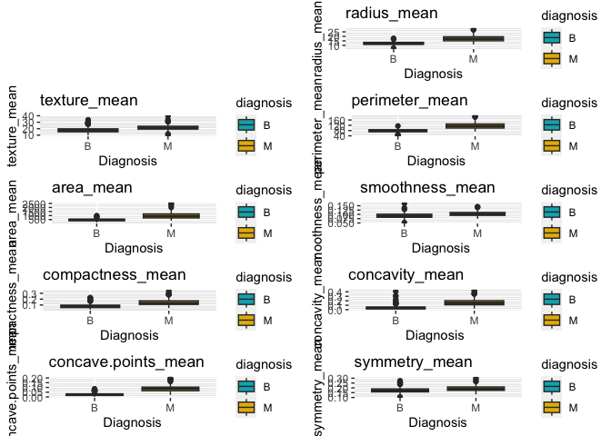
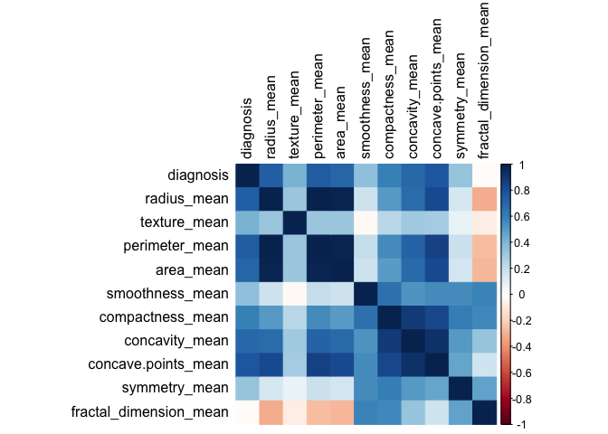
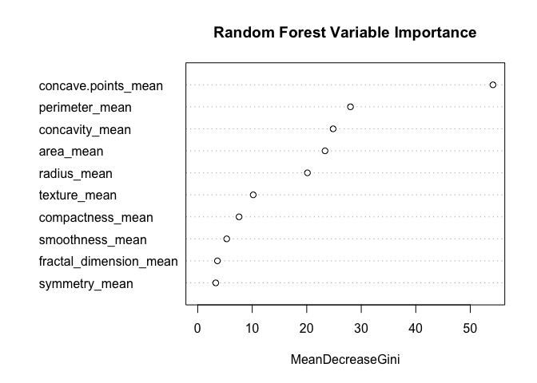
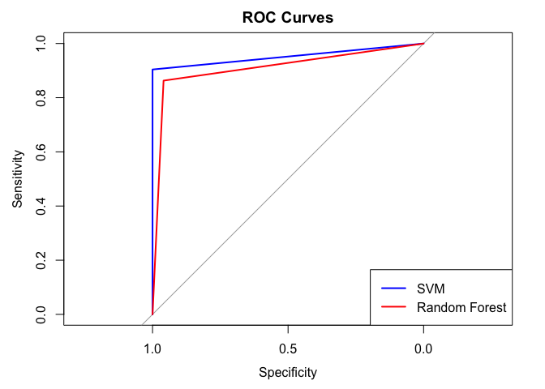

# Predictive Modeling of Breast Tumor Malignancy

## Bailey Taylor

### Introduction

According to the American Cancer Society, breast cancer stands as the
second leading cause of cancer-related deaths in women. Given its
severity, early detection is crucial for effective treatment and
improved patient outcomes. This study aims to evaluate the accuracy of
predicting breast tumor malignancy using morphological and textural
features of tumor cells, utilizing data from the University of Wisconsin
Diagnostic Breast Cancer dataset.

### Part 1: Data Preparation

``` r
# import data 
breast_cancer <- read.csv("breast-cancer.csv")
```

``` r
# first 6 rows 
head(breast_cancer)
```

    ##         id diagnosis radius_mean texture_mean perimeter_mean area_mean
    ## 1   842302         M       17.99        10.38         122.80    1001.0
    ## 2   842517         M       20.57        17.77         132.90    1326.0
    ## 3 84300903         M       19.69        21.25         130.00    1203.0
    ## 4 84348301         M       11.42        20.38          77.58     386.1
    ## 5 84358402         M       20.29        14.34         135.10    1297.0
    ## 6   843786         M       12.45        15.70          82.57     477.1
    ##   smoothness_mean compactness_mean concavity_mean concave.points_mean
    ## 1         0.11840          0.27760         0.3001             0.14710
    ## 2         0.08474          0.07864         0.0869             0.07017
    ## 3         0.10960          0.15990         0.1974             0.12790
    ## 4         0.14250          0.28390         0.2414             0.10520
    ## 5         0.10030          0.13280         0.1980             0.10430
    ## 6         0.12780          0.17000         0.1578             0.08089
    ##   symmetry_mean fractal_dimension_mean radius_se texture_se perimeter_se
    ## 1        0.2419                0.07871    1.0950     0.9053        8.589
    ## 2        0.1812                0.05667    0.5435     0.7339        3.398
    ## 3        0.2069                0.05999    0.7456     0.7869        4.585
    ## 4        0.2597                0.09744    0.4956     1.1560        3.445
    ## 5        0.1809                0.05883    0.7572     0.7813        5.438
    ## 6        0.2087                0.07613    0.3345     0.8902        2.217
    ##   area_se smoothness_se compactness_se concavity_se concave.points_se
    ## 1  153.40      0.006399        0.04904      0.05373           0.01587
    ## 2   74.08      0.005225        0.01308      0.01860           0.01340
    ## 3   94.03      0.006150        0.04006      0.03832           0.02058
    ## 4   27.23      0.009110        0.07458      0.05661           0.01867
    ## 5   94.44      0.011490        0.02461      0.05688           0.01885
    ## 6   27.19      0.007510        0.03345      0.03672           0.01137
    ##   symmetry_se fractal_dimension_se radius_worst texture_worst perimeter_worst
    ## 1     0.03003             0.006193        25.38         17.33          184.60
    ## 2     0.01389             0.003532        24.99         23.41          158.80
    ## 3     0.02250             0.004571        23.57         25.53          152.50
    ## 4     0.05963             0.009208        14.91         26.50           98.87
    ## 5     0.01756             0.005115        22.54         16.67          152.20
    ## 6     0.02165             0.005082        15.47         23.75          103.40
    ##   area_worst smoothness_worst compactness_worst concavity_worst
    ## 1     2019.0           0.1622            0.6656          0.7119
    ## 2     1956.0           0.1238            0.1866          0.2416
    ## 3     1709.0           0.1444            0.4245          0.4504
    ## 4      567.7           0.2098            0.8663          0.6869
    ## 5     1575.0           0.1374            0.2050          0.4000
    ## 6      741.6           0.1791            0.5249          0.5355
    ##   concave.points_worst symmetry_worst fractal_dimension_worst
    ## 1               0.2654         0.4601                 0.11890
    ## 2               0.1860         0.2750                 0.08902
    ## 3               0.2430         0.3613                 0.08758
    ## 4               0.2575         0.6638                 0.17300
    ## 5               0.1625         0.2364                 0.07678
    ## 6               0.1741         0.3985                 0.12440

``` r
# remove ID column
breast_cancer1 <- breast_cancer[, -c(1,13:32)]
head(breast_cancer1)
```

    ##   diagnosis radius_mean texture_mean perimeter_mean area_mean smoothness_mean
    ## 1         M       17.99        10.38         122.80    1001.0         0.11840
    ## 2         M       20.57        17.77         132.90    1326.0         0.08474
    ## 3         M       19.69        21.25         130.00    1203.0         0.10960
    ## 4         M       11.42        20.38          77.58     386.1         0.14250
    ## 5         M       20.29        14.34         135.10    1297.0         0.10030
    ## 6         M       12.45        15.70          82.57     477.1         0.12780
    ##   compactness_mean concavity_mean concave.points_mean symmetry_mean
    ## 1          0.27760         0.3001             0.14710        0.2419
    ## 2          0.07864         0.0869             0.07017        0.1812
    ## 3          0.15990         0.1974             0.12790        0.2069
    ## 4          0.28390         0.2414             0.10520        0.2597
    ## 5          0.13280         0.1980             0.10430        0.1809
    ## 6          0.17000         0.1578             0.08089        0.2087
    ##   fractal_dimension_mean
    ## 1                0.07871
    ## 2                0.05667
    ## 3                0.05999
    ## 4                0.09744
    ## 5                0.05883
    ## 6                0.07613

``` r
# remove _se and _worst columns 
```

``` r
# check for missing values 
sum(is.na(breast_cancer1))
```

    ## [1] 0

``` r
# Dummy code target variable "diagnosis", M = 1, B = 0
breast_cancer1$diagnosis <- ifelse(breast_cancer$diagnosis == "M", 1, 0)
head(breast_cancer1, 20)
```

    ##    diagnosis radius_mean texture_mean perimeter_mean area_mean smoothness_mean
    ## 1          1       17.99        10.38         122.80    1001.0         0.11840
    ## 2          1       20.57        17.77         132.90    1326.0         0.08474
    ## 3          1       19.69        21.25         130.00    1203.0         0.10960
    ## 4          1       11.42        20.38          77.58     386.1         0.14250
    ## 5          1       20.29        14.34         135.10    1297.0         0.10030
    ## 6          1       12.45        15.70          82.57     477.1         0.12780
    ## 7          1       18.25        19.98         119.60    1040.0         0.09463
    ## 8          1       13.71        20.83          90.20     577.9         0.11890
    ## 9          1       13.00        21.82          87.50     519.8         0.12730
    ## 10         1       12.46        24.04          83.97     475.9         0.11860
    ## 11         1       16.02        23.24         102.70     797.8         0.08206
    ## 12         1       15.78        17.89         103.60     781.0         0.09710
    ## 13         1       19.17        24.80         132.40    1123.0         0.09740
    ## 14         1       15.85        23.95         103.70     782.7         0.08401
    ## 15         1       13.73        22.61          93.60     578.3         0.11310
    ## 16         1       14.54        27.54          96.73     658.8         0.11390
    ## 17         1       14.68        20.13          94.74     684.5         0.09867
    ## 18         1       16.13        20.68         108.10     798.8         0.11700
    ## 19         1       19.81        22.15         130.00    1260.0         0.09831
    ## 20         0       13.54        14.36          87.46     566.3         0.09779
    ##    compactness_mean concavity_mean concave.points_mean symmetry_mean
    ## 1           0.27760        0.30010             0.14710        0.2419
    ## 2           0.07864        0.08690             0.07017        0.1812
    ## 3           0.15990        0.19740             0.12790        0.2069
    ## 4           0.28390        0.24140             0.10520        0.2597
    ## 5           0.13280        0.19800             0.10430        0.1809
    ## 6           0.17000        0.15780             0.08089        0.2087
    ## 7           0.10900        0.11270             0.07400        0.1794
    ## 8           0.16450        0.09366             0.05985        0.2196
    ## 9           0.19320        0.18590             0.09353        0.2350
    ## 10          0.23960        0.22730             0.08543        0.2030
    ## 11          0.06669        0.03299             0.03323        0.1528
    ## 12          0.12920        0.09954             0.06606        0.1842
    ## 13          0.24580        0.20650             0.11180        0.2397
    ## 14          0.10020        0.09938             0.05364        0.1847
    ## 15          0.22930        0.21280             0.08025        0.2069
    ## 16          0.15950        0.16390             0.07364        0.2303
    ## 17          0.07200        0.07395             0.05259        0.1586
    ## 18          0.20220        0.17220             0.10280        0.2164
    ## 19          0.10270        0.14790             0.09498        0.1582
    ## 20          0.08129        0.06664             0.04781        0.1885
    ##    fractal_dimension_mean
    ## 1                 0.07871
    ## 2                 0.05667
    ## 3                 0.05999
    ## 4                 0.09744
    ## 5                 0.05883
    ## 6                 0.07613
    ## 7                 0.05742
    ## 8                 0.07451
    ## 9                 0.07389
    ## 10                0.08243
    ## 11                0.05697
    ## 12                0.06082
    ## 13                0.07800
    ## 14                0.05338
    ## 15                0.07682
    ## 16                0.07077
    ## 17                0.05922
    ## 18                0.07356
    ## 19                0.05395
    ## 20                0.05766

### Part 2: Visualize the Data

``` r
# descriptive statistics 
summary(breast_cancer1)
```

    ##    diagnosis       radius_mean      texture_mean   perimeter_mean  
    ##  Min.   :0.0000   Min.   : 6.981   Min.   : 9.71   Min.   : 43.79  
    ##  1st Qu.:0.0000   1st Qu.:11.700   1st Qu.:16.17   1st Qu.: 75.17  
    ##  Median :0.0000   Median :13.370   Median :18.84   Median : 86.24  
    ##  Mean   :0.3726   Mean   :14.127   Mean   :19.29   Mean   : 91.97  
    ##  3rd Qu.:1.0000   3rd Qu.:15.780   3rd Qu.:21.80   3rd Qu.:104.10  
    ##  Max.   :1.0000   Max.   :28.110   Max.   :39.28   Max.   :188.50  
    ##    area_mean      smoothness_mean   compactness_mean  concavity_mean   
    ##  Min.   : 143.5   Min.   :0.05263   Min.   :0.01938   Min.   :0.00000  
    ##  1st Qu.: 420.3   1st Qu.:0.08637   1st Qu.:0.06492   1st Qu.:0.02956  
    ##  Median : 551.1   Median :0.09587   Median :0.09263   Median :0.06154  
    ##  Mean   : 654.9   Mean   :0.09636   Mean   :0.10434   Mean   :0.08880  
    ##  3rd Qu.: 782.7   3rd Qu.:0.10530   3rd Qu.:0.13040   3rd Qu.:0.13070  
    ##  Max.   :2501.0   Max.   :0.16340   Max.   :0.34540   Max.   :0.42680  
    ##  concave.points_mean symmetry_mean    fractal_dimension_mean
    ##  Min.   :0.00000     Min.   :0.1060   Min.   :0.04996       
    ##  1st Qu.:0.02031     1st Qu.:0.1619   1st Qu.:0.05770       
    ##  Median :0.03350     Median :0.1792   Median :0.06154       
    ##  Mean   :0.04892     Mean   :0.1812   Mean   :0.06280       
    ##  3rd Qu.:0.07400     3rd Qu.:0.1957   3rd Qu.:0.06612       
    ##  Max.   :0.20120     Max.   :0.3040   Max.   :0.09744

``` r
# Count of M and B
count<- table(breast_cancer1$diagnosis)
count
```

    ## 
    ##   0   1 
    ## 357 212

``` r
percentages <- round(100 * count / sum(count), 1)
percentages_label <- paste(c("B", "M"), "\n", percentages, "%", sep = "")
pie(count, labels = percentages_label, col = c('#00AFBB', '#E7B800'),
    main = "Distribution of Diagnosis")
```

<!-- -->

``` r
# Histograms
library(Hmisc)
```

    ## 
    ## Attaching package: 'Hmisc'

    ## The following objects are masked from 'package:base':
    ## 
    ##     format.pval, units

``` r
hist.data.frame(breast_cancer1)
```

<!-- -->

``` r
# Histograms 
library(ggplot2)

h1 <- ggplot(breast_cancer1, aes(x = radius_mean, fill = as.factor(diagnosis))) +
  geom_histogram(position = "identity", alpha = 0.7, bins = 30) +
  labs(title = "Radius Mean",
       x = "Radius Mean",
       y = "Frequency") +
  scale_fill_manual(values = c("0" = "#00AFBB", "1" = "#E7B800")) 

h2 <- ggplot(breast_cancer1, aes(x = texture_mean, fill = as.factor(diagnosis))) +
  geom_histogram(position = "identity", alpha = 0.7, bins = 30) +
  labs(title = "Texture Mean",
       x = "Texture Mean",
       y = "Frequency") +
  scale_fill_manual(values = c("0" = "#00AFBB", "1" = "#E7B800")) 

h3 <- ggplot(breast_cancer1, aes(x = perimeter_mean, fill = as.factor(diagnosis))) +
  geom_histogram(position = "identity", alpha = 0.7, bins = 30) +
  labs(title = "Perimeter Mean",
       x = "Perimeter Mean",
       y = "Frequency") +
  scale_fill_manual(values = c("0" = "#00AFBB", "1" = "#E7B800")) 

h4 <- ggplot(breast_cancer1, aes(x = area_mean, fill = as.factor(diagnosis))) +
  geom_histogram(position = "identity", alpha = 0.7, bins = 30) +
  labs(title = "Area Mean",
       x = "Area Mean",
       y = "Frequency") +
  scale_fill_manual(values = c("0" = "#00AFBB", "1" = "#E7B800")) 

h5 <- ggplot(breast_cancer1, aes(x = smoothness_mean, fill = as.factor(diagnosis))) +
  geom_histogram(position = "identity", alpha = 0.7, bins = 30) +
  labs(title = "Smoothness Mean",
       x = "Texture Mean",
       y = "Frequency") +
  scale_fill_manual(values = c("0" = "#00AFBB", "1" = "#E7B800")) 

h6 <- ggplot(breast_cancer1, aes(x = compactness_mean, fill = as.factor(diagnosis))) +
  geom_histogram(position = "identity", alpha = 0.7, bins = 30) +
  labs(title = "Compactness Mean",
       x = "Compactness Mean",
       y = "Frequency") +
  scale_fill_manual(values = c("0" = "#00AFBB", "1" = "#E7B800")) 

h7 <- ggplot(breast_cancer1, aes(x = concavity_mean, fill = as.factor(diagnosis))) +
  geom_histogram(position = "identity", alpha = 0.7, bins = 30) +
  labs(title = "Concavity Mean",
       x = "Concavity Mean",
       y = "Frequency") +
  scale_fill_manual(values = c("0" = "#00AFBB", "1" = "#E7B800")) 

h8 <- ggplot(breast_cancer1, aes(x = concave.points_mean, fill = as.factor(diagnosis))) +
  geom_histogram(position = "identity", alpha = 0.7, bins = 30) +
  labs(title = "Concave Points Mean",
       x = "Concave Points Mean",
       y = "Frequency") +
  scale_fill_manual(values = c("0" = "#00AFBB", "1" = "#E7B800")) 

h9 <- ggplot(breast_cancer1, aes(x = symmetry_mean, fill = as.factor(diagnosis))) +
  geom_histogram(position = "identity", alpha = 0.7, bins = 30) +
  labs(title = "Symmetry Mean",
       x = "Symmetry Mean",
       y = "Frequency") +
  scale_fill_manual(values = c("0" = "#00AFBB", "1" = "#E7B800")) 

h10 <- ggplot(breast_cancer1, aes(x = fractal_dimension_mean, fill = as.factor(diagnosis))) +
  geom_histogram(position = "identity", alpha = 0.7, bins = 30) +
  labs(title = "Fractal Dimension Mean",
       x = "Fractal Dimension Mean",
       y = "Frequency") +
  scale_fill_manual(values = c("0" = "#00AFBB", "1" = "#E7B800")) 


library(gridExtra)
grid.arrange(h1, h2, h3, h4, h5, h6, h7, h8, h9, h10, ncol = 2)
```

<!-- -->

``` r
# Scatterplots by patient ID

library(ggplot2)
# radius 
plot1<- ggplot(breast_cancer, aes(radius_mean, id)) +
  geom_point(aes(color=diagnosis)) +
  scale_color_manual(values=c('#00AFBB', '#E7B800'))

# texture
plot2 <- ggplot(breast_cancer, aes(texture_mean, id)) +
  geom_point(aes(color=diagnosis)) +
  scale_color_manual(values=c('#00AFBB', '#E7B800'))

# perimeter
plot3 <- ggplot(breast_cancer, aes(perimeter_mean, id)) +
  geom_point(aes(color=diagnosis)) +
  scale_color_manual(values=c('#00AFBB', '#E7B800'))

# area
plot4 <- ggplot(breast_cancer, aes(area_mean, id)) +
  geom_point(aes(color=diagnosis)) +
  scale_color_manual(values=c('#00AFBB', '#E7B800'))

# smoothness 
plot5 <- ggplot(breast_cancer, aes(smoothness_mean, id)) +
  geom_point(aes(color=diagnosis)) +
  scale_color_manual(values=c('#00AFBB', '#E7B800'))


# compactness 
plot6 <- ggplot(breast_cancer, aes(compactness_mean, id)) +
  geom_point(aes(color=diagnosis)) +
  scale_color_manual(values=c('#00AFBB', '#E7B800'))


# concavity
plot7 <- ggplot(breast_cancer, aes(concavity_mean, id)) +
  geom_point(aes(color=diagnosis)) +
  scale_color_manual(values=c('#00AFBB', '#E7B800'))


# concave points 
plot8 <- ggplot(breast_cancer, aes(concave.points_mean, id)) +
  geom_point(aes(color=diagnosis)) +
  scale_color_manual(values=c('#00AFBB', '#E7B800'))

# symmetry 
plot9 <- ggplot(breast_cancer, aes(symmetry_mean, id)) +
  geom_point(aes(color=diagnosis)) +
  scale_color_manual(values=c('#00AFBB', '#E7B800'))


# fractal dimension
plot10 <- ggplot(breast_cancer, aes(fractal_dimension_mean, id)) +
  geom_point(aes(color=diagnosis)) +
  scale_color_manual(values=c('#00AFBB', '#E7B800'))


library(gridExtra)
grid.arrange(plot1, plot2, plot3, plot4, plot5, plot6, plot7, plot8, plot9, plot10, ncol = 2)
```

<!-- -->

``` r
pairs(breast_cancer1[, c("radius_mean", "texture_mean", "perimeter_mean", "area_mean", "smoothness_mean", "compactness_mean", "concavity_mean", "concave.points_mean", "symmetry_mean", "fractal_dimension_mean")],
      col = c("#00AFBB", "#E7B800")[breast_cancer1$diagnosis + 1], lower.panel = NULL)
par(xpd = TRUE)
legend("bottomleft", legend = c("B", "M"), col = c("#00AFBB", "#E7B800"), pch = 1)
```

<!-- -->

``` r
# Boxplots
library(ggplot2)
library(gridExtra)

# Create a list to store the plots
boxplots_list <- list()

for (i in 2:10) {
  feature_name <- colnames(breast_cancer)[i + 1]  
  
  # Create a boxplot for the current feature
  boxplots_list[[i]] <- ggplot(breast_cancer, aes(x = diagnosis, y = .data[[feature_name]], fill = diagnosis)) +
    geom_boxplot() +
    scale_fill_manual(values = c('#00AFBB', '#E7B800')) +
    labs(title = paste(feature_name),
         x = "Diagnosis",
         y = feature_name)
}

grid.arrange(grobs = boxplots_list, ncol = 2)
```

<!-- -->

``` r
# correlation matrix 
library(corrplot)
```

    ## corrplot 0.92 loaded

``` r
cor_matrix <- cor(breast_cancer1)
corrplot(
  cor_matrix,
  tl.cex = 1,  
  tl.col = "black", 
  method = 'color'
)
```

<!-- -->

### Part 3: Random Forest

``` r
# split into training and test sets 
set.seed(123)
sample_indices <- sample(1:nrow(breast_cancer1), 0.7 * nrow(breast_cancer1))

train_set <- breast_cancer1[sample_indices, ]

test_set <- breast_cancer1[-sample_indices, ]

head(train_set)
```

    ##     diagnosis radius_mean texture_mean perimeter_mean area_mean smoothness_mean
    ## 415         1      15.130        29.81          96.71     719.5         0.08320
    ## 463         0      14.400        26.99          92.25     646.1         0.06995
    ## 179         0      13.010        22.22          82.01     526.4         0.06251
    ## 526         0       8.571        13.10          54.53     221.3         0.10360
    ## 195         1      14.860        23.21         100.40     671.4         0.10440
    ## 118         1      14.870        16.67          98.64     682.5         0.11620
    ##     compactness_mean concavity_mean concave.points_mean symmetry_mean
    ## 415          0.04605       0.046860            0.027390        0.1852
    ## 463          0.05223       0.034760            0.017370        0.1707
    ## 179          0.01938       0.001595            0.001852        0.1395
    ## 526          0.07632       0.025650            0.015100        0.1678
    ## 195          0.19800       0.169700            0.088780        0.1737
    ## 118          0.16490       0.169000            0.089230        0.2157
    ##     fractal_dimension_mean
    ## 415                0.05294
    ## 463                0.05433
    ## 179                0.05234
    ## 526                0.07126
    ## 195                0.06672
    ## 118                0.06768

``` r
head(test_set)
```

    ##    diagnosis radius_mean texture_mean perimeter_mean area_mean smoothness_mean
    ## 1          1       17.99        10.38         122.80    1001.0         0.11840
    ## 2          1       20.57        17.77         132.90    1326.0         0.08474
    ## 9          1       13.00        21.82          87.50     519.8         0.12730
    ## 15         1       13.73        22.61          93.60     578.3         0.11310
    ## 17         1       14.68        20.13          94.74     684.5         0.09867
    ## 18         1       16.13        20.68         108.10     798.8         0.11700
    ##    compactness_mean concavity_mean concave.points_mean symmetry_mean
    ## 1           0.27760        0.30010             0.14710        0.2419
    ## 2           0.07864        0.08690             0.07017        0.1812
    ## 9           0.19320        0.18590             0.09353        0.2350
    ## 15          0.22930        0.21280             0.08025        0.2069
    ## 17          0.07200        0.07395             0.05259        0.1586
    ## 18          0.20220        0.17220             0.10280        0.2164
    ##    fractal_dimension_mean
    ## 1                 0.07871
    ## 2                 0.05667
    ## 9                 0.07389
    ## 15                0.07682
    ## 17                0.05922
    ## 18                0.07356

``` r
library(randomForest)
```

    ## randomForest 4.7-1.1

    ## Type rfNews() to see new features/changes/bug fixes.

    ## 
    ## Attaching package: 'randomForest'

    ## The following object is masked from 'package:gridExtra':
    ## 
    ##     combine

    ## The following object is masked from 'package:ggplot2':
    ## 
    ##     margin

``` r
set.seed(123)
# train random forest model
rf <- randomForest(as.factor(diagnosis) ~ ., data = train_set, ntree = 500)
print(rf)
```

    ## 
    ## Call:
    ##  randomForest(formula = as.factor(diagnosis) ~ ., data = train_set,      ntree = 500) 
    ##                Type of random forest: classification
    ##                      Number of trees: 500
    ## No. of variables tried at each split: 3
    ## 
    ##         OOB estimate of  error rate: 5.53%
    ## Confusion matrix:
    ##     0   1 class.error
    ## 0 250   9  0.03474903
    ## 1  13 126  0.09352518

``` r
# training set confusion matrix
rf.preds <- predict(rf, data = train_set)
confusion_matrix0 <- table(rf.preds, train_set$diagnosis)
confusion_matrix0
```

    ##         
    ## rf.preds   0   1
    ##        0 250  13
    ##        1   9 126

``` r
# make predictions on test set 
rf.predictions <- predict(rf, newdata = test_set)

# test set confusion matrix 
confusion_matrix1 <- table(rf.predictions, test_set$diagnosis)
confusion_matrix1
```

    ##               
    ## rf.predictions  0  1
    ##              0 94 10
    ##              1  4 63

``` r
# variable importance 
varImpPlot(rf, main = "Random Forest Variable Importance")
```

<!-- -->

``` r
# Calculate classification metrics (Train)
accuracy1 <- sum(diag(confusion_matrix0)) / sum(confusion_matrix0)
precision1 <- confusion_matrix0[2, 2] / sum(confusion_matrix0[, 2])
recall1 <- confusion_matrix0[2, 2] / sum(confusion_matrix0[2, ])
f1_score1 <- 2 * (precision1 * recall1) / (precision1 + recall1)

print(paste("Accuracy:", accuracy1))
```

    ## [1] "Accuracy: 0.944723618090452"

``` r
print(paste("Precision:", precision1))
```

    ## [1] "Precision: 0.906474820143885"

``` r
print(paste("Recall:", recall1))
```

    ## [1] "Recall: 0.933333333333333"

``` r
print(paste("F1-Score:", f1_score1))
```

    ## [1] "F1-Score: 0.91970802919708"

``` r
# Calculate classification metrics (Test)
accuracy <- sum(diag(confusion_matrix1)) / sum(confusion_matrix1)
precision <- confusion_matrix1[2, 2] / sum(confusion_matrix1[, 2])
recall <- confusion_matrix1[2, 2] / sum(confusion_matrix1[2, ])
f1_score <- 2 * (precision * recall) / (precision + recall)

print(paste("Accuracy:", accuracy))
```

    ## [1] "Accuracy: 0.91812865497076"

``` r
print(paste("Precision:", precision))
```

    ## [1] "Precision: 0.863013698630137"

``` r
print(paste("Recall:", recall))
```

    ## [1] "Recall: 0.940298507462687"

``` r
print(paste("F1-Score:", f1_score))
```

    ## [1] "F1-Score: 0.9"

``` r
#train error 
train.rf.error <- mean(rf.preds != train_set$diagnosis)

# test error 
test.rf.error2 <- mean(rf.predictions != test_set$diagnosis)

print(paste("Training Error:", train.rf.error))
```

    ## [1] "Training Error: 0.0552763819095477"

``` r
print(paste("Test Error:", test.rf.error2))
```

    ## [1] "Test Error: 0.0818713450292398"

### Part 4: SVM

``` r
# find best cost for linear kernal 

library(e1071)
```

    ## 
    ## Attaching package: 'e1071'

    ## The following object is masked from 'package:Hmisc':
    ## 
    ##     impute

``` r
set.seed(123)
tune1 <- tune(e1071::svm, diagnosis ~ ., data = train_set, kernel = "linear", ranges = list(cost = c(seq(0.01,0.1,by = 0.1), seq(0.1,1,by = 0.1), seq(1,10, by = 1), seq(10,50, by = 10))))

summary(tune1)
```

    ## 
    ## Parameter tuning of 'e1071::svm':
    ## 
    ## - sampling method: 10-fold cross validation 
    ## 
    ## - best parameters:
    ##  cost
    ##  0.01
    ## 
    ## - best performance: 0.08322464 
    ## 
    ## - Detailed performance results:
    ##     cost      error dispersion
    ## 1   0.01 0.08322464 0.01624401
    ## 2   0.10 0.08598204 0.01735182
    ## 3   0.20 0.08757047 0.01814844
    ## 4   0.30 0.08839384 0.01856281
    ## 5   0.40 0.08930556 0.01912674
    ## 6   0.50 0.09007230 0.01959449
    ## 7   0.60 0.09059756 0.01988150
    ## 8   0.70 0.09100625 0.02018609
    ## 9   0.80 0.09126222 0.02029138
    ## 10  0.90 0.09137037 0.02038625
    ## 11  1.00 0.09145744 0.02048705
    ## 12  1.00 0.09145744 0.02048705
    ## 13  2.00 0.09245016 0.02136625
    ## 14  3.00 0.09312019 0.02158747
    ## 15  4.00 0.09335261 0.02157933
    ## 16  5.00 0.09343415 0.02156250
    ## 17  6.00 0.09347290 0.02165732
    ## 18  7.00 0.09350471 0.02165759
    ## 19  8.00 0.09356257 0.02162138
    ## 20  9.00 0.09358273 0.02163063
    ## 21 10.00 0.09364677 0.02169148
    ## 22 10.00 0.09364677 0.02169148
    ## 23 20.00 0.09395164 0.02186012
    ## 24 30.00 0.09395720 0.02185861
    ## 25 40.00 0.09402617 0.02182693
    ## 26 50.00 0.09402622 0.02190203

``` r
# pull out best cost 
c <- tune1$performances
c[c$error == min(c$error),]
```

    ##   cost      error dispersion
    ## 1 0.01 0.08322464 0.01624401

``` r
best.cost <- tune1$best.model$cost
```

``` r
# compute training and test errors with best cost 
library(e1071)
set.seed(123)
svm_bcost <- svm(diagnosis ~ ., data = train_set, kernel = "linear", type = "C-classification", cost = best.cost)

pred_train <- predict(svm_bcost, train_set)
train.error <- mean(pred_train != train_set$diagnosis)

confm <- table(Predicted = pred_train, Actual = train_set$diagnosis)
confm
```

    ##          Actual
    ## Predicted   0   1
    ##         0 255  23
    ##         1   4 116

``` r
pred_test <- predict(svm_bcost, test_set)
test.error <- mean(pred_test != test_set$diagnosis)

confm1 <- table(Predicted = pred_test, Actual = test_set$diagnosis)
confm1
```

    ##          Actual
    ## Predicted  0  1
    ##         0 97 13
    ##         1  1 60

``` r
linear_svm <- data.frame("Kernal" = "Linear", "Cost" = best.cost, "Training Error" = train.error, "Testing Error" = test.error)

linear_svm
```

    ##   Kernal Cost Training.Error Testing.Error
    ## 1 Linear 0.01      0.0678392    0.08187135

``` r
# radial kernal 

library(e1071)
set.seed(123)
tune2 <- tune(e1071::svm, diagnosis ~ ., data = train_set, kernel = "radial", ranges = list(cost = c(seq(0.01,0.1,by = 0.1), seq(0.1,1,by = 0.1), seq(1,10, by = 1)),
                                                                                            gamma = c(seq(0.1,1,by=0.1), seq(1,10,by=1))))

summary(tune2)
```

    ## 
    ## Parameter tuning of 'e1071::svm':
    ## 
    ## - sampling method: 10-fold cross validation 
    ## 
    ## - best parameters:
    ##  cost gamma
    ##     3   0.1
    ## 
    ## - best performance: 0.04500677 
    ## 
    ## - Detailed performance results:
    ##      cost gamma      error dispersion
    ## 1    0.01   0.1 0.19146455 0.03165177
    ## 2    0.10   0.1 0.06096946 0.01882515
    ## 3    0.20   0.1 0.05427601 0.01908727
    ## 4    0.30   0.1 0.05159041 0.01893253
    ## 5    0.40   0.1 0.04990308 0.01851969
    ## 6    0.50   0.1 0.04906236 0.01848386
    ## 7    0.60   0.1 0.04832190 0.01832200
    ## 8    0.70   0.1 0.04782257 0.01819821
    ## 9    0.80   0.1 0.04747534 0.01821005
    ## 10   0.90   0.1 0.04726541 0.01834187
    ## 11   1.00   0.1 0.04714020 0.01847156
    ## 12   1.00   0.1 0.04714020 0.01847156
    ## 13   2.00   0.1 0.04543830 0.01860201
    ## 14   3.00   0.1 0.04500677 0.01840206
    ## 15   4.00   0.1 0.04520340 0.01871578
    ## 16   5.00   0.1 0.04543999 0.01907557
    ## 17   6.00   0.1 0.04565064 0.01921300
    ## 18   7.00   0.1 0.04570853 0.01933142
    ## 19   8.00   0.1 0.04571319 0.01945091
    ## 20   9.00   0.1 0.04578497 0.01954149
    ## 21  10.00   0.1 0.04593695 0.01954882
    ## 22   0.01   0.2 0.23364332 0.03789507
    ## 23   0.10   0.2 0.06712711 0.01873727
    ## 24   0.20   0.2 0.05846838 0.01911941
    ## 25   0.30   0.2 0.05502881 0.01960457
    ## 26   0.40   0.2 0.05282987 0.01990675
    ## 27   0.50   0.2 0.05129317 0.01993740
    ## 28   0.60   0.2 0.05055415 0.01998158
    ## 29   0.70   0.2 0.04988469 0.01996274
    ## 30   0.80   0.2 0.04933569 0.01983410
    ## 31   0.90   0.2 0.04882442 0.01968181
    ## 32   1.00   0.2 0.04842569 0.01966963
    ## 33   1.00   0.2 0.04842569 0.01966963
    ## 34   2.00   0.2 0.04828041 0.02024767
    ## 35   3.00   0.2 0.04936446 0.02067173
    ## 36   4.00   0.2 0.05029422 0.02094029
    ## 37   5.00   0.2 0.05146407 0.02117088
    ## 38   6.00   0.2 0.05261870 0.02142527
    ## 39   7.00   0.2 0.05356971 0.02149746
    ## 40   8.00   0.2 0.05413683 0.02100232
    ## 41   9.00   0.2 0.05460542 0.02054706
    ## 42  10.00   0.2 0.05494524 0.02023417
    ## 43   0.01   0.3 0.26145320 0.04211100
    ## 44   0.10   0.3 0.07826089 0.01857850
    ## 45   0.20   0.3 0.06465983 0.01968382
    ## 46   0.30   0.3 0.06024002 0.02007324
    ## 47   0.40   0.3 0.05798779 0.02044701
    ## 48   0.50   0.3 0.05616206 0.02032350
    ## 49   0.60   0.3 0.05498540 0.02025121
    ## 50   0.70   0.3 0.05421757 0.02033220
    ## 51   0.80   0.3 0.05371696 0.02032645
    ## 52   0.90   0.3 0.05358068 0.02044216
    ## 53   1.00   0.3 0.05369895 0.02055915
    ## 54   1.00   0.3 0.05369895 0.02055915
    ## 55   2.00   0.3 0.05514539 0.02100874
    ## 56   3.00   0.3 0.05671214 0.02188924
    ## 57   4.00   0.3 0.05710797 0.02090313
    ## 58   5.00   0.3 0.05759602 0.02049452
    ## 59   6.00   0.3 0.05819451 0.02048116
    ## 60   7.00   0.3 0.05894504 0.02051861
    ## 61   8.00   0.3 0.05969580 0.02019589
    ## 62   9.00   0.3 0.06049003 0.01986179
    ## 63  10.00   0.3 0.06114899 0.01945341
    ## 64   0.01   0.4 0.27861500 0.04474434
    ## 65   0.10   0.4 0.09505616 0.01835474
    ## 66   0.20   0.4 0.07294845 0.02021531
    ## 67   0.30   0.4 0.06705929 0.02067037
    ## 68   0.40   0.4 0.06454093 0.02065109
    ## 69   0.50   0.4 0.06293661 0.02057098
    ## 70   0.60   0.4 0.06162156 0.02065086
    ## 71   0.70   0.4 0.06086878 0.02090363
    ## 72   0.80   0.4 0.06059570 0.02106379
    ## 73   0.90   0.4 0.06048985 0.02124148
    ## 74   1.00   0.4 0.06054122 0.02142336
    ## 75   1.00   0.4 0.06054122 0.02142336
    ## 76   2.00   0.4 0.06236906 0.02271522
    ## 77   3.00   0.4 0.06263701 0.02209821
    ## 78   4.00   0.4 0.06303630 0.02144229
    ## 79   5.00   0.4 0.06381632 0.02059358
    ## 80   6.00   0.4 0.06475364 0.01952695
    ## 81   7.00   0.4 0.06573083 0.01846077
    ## 82   8.00   0.4 0.06662423 0.01768553
    ## 83   9.00   0.4 0.06747294 0.01690377
    ## 84  10.00   0.4 0.06835049 0.01605337
    ## 85   0.01   0.5 0.28933357 0.04634395
    ## 86   0.10   0.5 0.11808963 0.01951197
    ## 87   0.20   0.5 0.08299036 0.02000711
    ## 88   0.30   0.5 0.07418675 0.02104497
    ## 89   0.40   0.5 0.07122129 0.02096851
    ## 90   0.50   0.5 0.06963595 0.02097533
    ## 91   0.60   0.5 0.06834783 0.02116224
    ## 92   0.70   0.5 0.06749972 0.02143858
    ## 93   0.80   0.5 0.06711649 0.02172493
    ## 94   0.90   0.5 0.06702113 0.02204585
    ## 95   1.00   0.5 0.06714009 0.02236228
    ## 96   1.00   0.5 0.06714009 0.02236228
    ## 97   2.00   0.5 0.06848153 0.02340975
    ## 98   3.00   0.5 0.06868004 0.02227591
    ## 99   4.00   0.5 0.06948241 0.02105510
    ## 100  5.00   0.5 0.07044372 0.01988166
    ## 101  6.00   0.5 0.07138639 0.01881156
    ## 102  7.00   0.5 0.07227140 0.01778544
    ## 103  8.00   0.5 0.07329513 0.01698953
    ## 104  9.00   0.5 0.07407849 0.01628839
    ## 105 10.00   0.5 0.07484130 0.01572785
    ## 106  0.01   0.6 0.29629823 0.04736352
    ## 107  0.10   0.6 0.14802614 0.02416781
    ## 108  0.20   0.6 0.09533496 0.01954156
    ## 109  0.30   0.6 0.08254628 0.02075554
    ## 110  0.40   0.6 0.07769978 0.02109243
    ## 111  0.50   0.6 0.07589319 0.02116681
    ## 112  0.60   0.6 0.07466431 0.02142505
    ## 113  0.70   0.6 0.07382661 0.02184293
    ## 114  0.80   0.6 0.07342284 0.02221882
    ## 115  0.90   0.6 0.07329370 0.02265662
    ## 116  1.00   0.6 0.07339661 0.02310209
    ## 117  1.00   0.6 0.07339661 0.02310209
    ## 118  2.00   0.6 0.07420790 0.02370678
    ## 119  3.00   0.6 0.07452911 0.02237497
    ## 120  4.00   0.6 0.07543025 0.02107011
    ## 121  5.00   0.6 0.07647412 0.01971910
    ## 122  6.00   0.6 0.07762111 0.01864921
    ## 123  7.00   0.6 0.07846754 0.01781918
    ## 124  8.00   0.6 0.07922698 0.01694113
    ## 125  9.00   0.6 0.07983009 0.01637546
    ## 126 10.00   0.6 0.07999485 0.01600477
    ## 127  0.01   0.7 0.30106450 0.04806560
    ## 128  0.10   0.7 0.17635652 0.02860042
    ## 129  0.20   0.7 0.11042586 0.01916741
    ## 130  0.30   0.7 0.09174987 0.02033050
    ## 131  0.40   0.7 0.08501400 0.02091681
    ## 132  0.50   0.7 0.08218120 0.02120351
    ## 133  0.60   0.7 0.08077114 0.02151571
    ## 134  0.70   0.7 0.07993628 0.02200713
    ## 135  0.80   0.7 0.07947594 0.02246995
    ## 136  0.90   0.7 0.07922049 0.02304584
    ## 137  1.00   0.7 0.07929285 0.02362051
    ## 138  1.00   0.7 0.07929285 0.02362051
    ## 139  2.00   0.7 0.07961156 0.02359886
    ## 140  3.00   0.7 0.08031788 0.02221982
    ## 141  4.00   0.7 0.08153043 0.02073551
    ## 142  5.00   0.7 0.08248287 0.01953019
    ## 143  6.00   0.7 0.08304611 0.01846887
    ## 144  7.00   0.7 0.08336983 0.01780082
    ## 145  8.00   0.7 0.08329848 0.01723877
    ## 146  9.00   0.7 0.08346124 0.01701278
    ## 147 10.00   0.7 0.08368480 0.01682085
    ## 148  0.01   0.8 0.30446020 0.04856128
    ## 149  0.10   0.8 0.19944451 0.03231077
    ## 150  0.20   0.8 0.12880975 0.02056282
    ## 151  0.30   0.8 0.10263212 0.01996926
    ## 152  0.40   0.8 0.09277202 0.02062731
    ## 153  0.50   0.8 0.08868731 0.02110656
    ## 154  0.60   0.8 0.08685931 0.02146803
    ## 155  0.70   0.8 0.08586595 0.02194199
    ## 156  0.80   0.8 0.08528842 0.02251470
    ## 157  0.90   0.8 0.08491692 0.02326215
    ## 158  1.00   0.8 0.08501447 0.02397836
    ## 159  1.00   0.8 0.08501447 0.02397836
    ## 160  2.00   0.8 0.08523794 0.02335799
    ## 161  3.00   0.8 0.08652115 0.02197131
    ## 162  4.00   0.8 0.08731181 0.02033615
    ## 163  5.00   0.8 0.08749359 0.01924176
    ## 164  6.00   0.8 0.08750798 0.01850765
    ## 165  7.00   0.8 0.08763495 0.01809374
    ## 166  8.00   0.8 0.08789517 0.01783579
    ## 167  9.00   0.8 0.08828544 0.01753992
    ## 168 10.00   0.8 0.08868156 0.01726463
    ## 169  0.01   0.9 0.30693509 0.04892943
    ## 170  0.10   0.9 0.21776073 0.03529461
    ## 171  0.20   0.9 0.14779270 0.02384338
    ## 172  0.30   0.9 0.11554607 0.01976906
    ## 173  0.40   0.9 0.10151930 0.02028087
    ## 174  0.50   0.9 0.09569403 0.02091672
    ## 175  0.60   0.9 0.09298677 0.02140435
    ## 176  0.70   0.9 0.09168127 0.02184895
    ## 177  0.80   0.9 0.09093481 0.02257088
    ## 178  0.90   0.9 0.09051244 0.02343773
    ## 179  1.00   0.9 0.09057617 0.02426959
    ## 180  1.00   0.9 0.09057617 0.02426959
    ## 181  2.00   0.9 0.09098105 0.02327790
    ## 182  3.00   0.9 0.09222056 0.02162841
    ## 183  4.00   0.9 0.09229216 0.02013504
    ## 184  5.00   0.9 0.09215718 0.01927830
    ## 185  6.00   0.9 0.09231573 0.01882785
    ## 186  7.00   0.9 0.09268918 0.01845787
    ## 187  8.00   0.9 0.09314560 0.01807671
    ## 188  9.00   0.9 0.09362831 0.01774006
    ## 189 10.00   0.9 0.09416564 0.01741918
    ## 190  0.01   1.0 0.30878737 0.04920596
    ## 191  0.10   1.0 0.23229664 0.03765029
    ## 192  0.20   1.0 0.16781463 0.02713159
    ## 193  0.30   1.0 0.12969262 0.02088727
    ## 194  0.40   1.0 0.11160383 0.02012716
    ## 195  0.50   1.0 0.10317582 0.02062470
    ## 196  0.60   1.0 0.09943437 0.02119767
    ## 197  0.70   1.0 0.09753889 0.02176388
    ## 198  0.80   1.0 0.09648199 0.02251190
    ## 199  0.90   1.0 0.09600830 0.02338270
    ## 200  1.00   1.0 0.09601730 0.02423170
    ## 201  1.00   1.0 0.09601730 0.02423170
    ## 202  2.00   1.0 0.09667533 0.02297686
    ## 203  3.00   1.0 0.09750239 0.02116394
    ## 204  4.00   1.0 0.09718111 0.02003999
    ## 205  5.00   1.0 0.09719948 0.01937700
    ## 206  6.00   1.0 0.09764004 0.01892475
    ## 207  7.00   1.0 0.09819665 0.01845925
    ## 208  8.00   1.0 0.09879322 0.01803106
    ## 209  9.00   1.0 0.09924191 0.01776715
    ## 210 10.00   1.0 0.09962671 0.01764370
    ## 211  0.01   1.0 0.30878737 0.04920596
    ## 212  0.10   1.0 0.23229664 0.03765029
    ## 213  0.20   1.0 0.16781463 0.02713159
    ## 214  0.30   1.0 0.12969262 0.02088727
    ## 215  0.40   1.0 0.11160383 0.02012716
    ## 216  0.50   1.0 0.10317582 0.02062470
    ## 217  0.60   1.0 0.09943437 0.02119767
    ## 218  0.70   1.0 0.09753889 0.02176388
    ## 219  0.80   1.0 0.09648199 0.02251190
    ## 220  0.90   1.0 0.09600830 0.02338270
    ## 221  1.00   1.0 0.09601730 0.02423170
    ## 222  1.00   1.0 0.09601730 0.02423170
    ## 223  2.00   1.0 0.09667533 0.02297686
    ## 224  3.00   1.0 0.09750239 0.02116394
    ## 225  4.00   1.0 0.09718111 0.02003999
    ## 226  5.00   1.0 0.09719948 0.01937700
    ## 227  6.00   1.0 0.09764004 0.01892475
    ## 228  7.00   1.0 0.09819665 0.01845925
    ## 229  8.00   1.0 0.09879322 0.01803106
    ## 230  9.00   1.0 0.09924191 0.01776715
    ## 231 10.00   1.0 0.09962671 0.01764370
    ## 232  0.01   2.0 0.31487323 0.05004946
    ## 233  0.10   2.0 0.28502846 0.04538197
    ## 234  0.20   2.0 0.25510910 0.04051852
    ## 235  0.30   2.0 0.22859751 0.03602142
    ## 236  0.40   2.0 0.20549683 0.03194375
    ## 237  0.50   2.0 0.18580687 0.02836162
    ## 238  0.60   2.0 0.16976156 0.02534874
    ## 239  0.70   2.0 0.15867838 0.02319217
    ## 240  0.80   2.0 0.15115431 0.02200606
    ## 241  0.90   2.0 0.14688586 0.02131886
    ## 242  1.00   2.0 0.14499820 0.02097747
    ## 243  1.00   2.0 0.14499820 0.02097747
    ## 244  2.00   2.0 0.14505590 0.01934440
    ## 245  3.00   2.0 0.14594653 0.01874252
    ## 246  4.00   2.0 0.14643141 0.01846933
    ## 247  5.00   2.0 0.14693879 0.01827873
    ## 248  6.00   2.0 0.14707471 0.01815366
    ## 249  7.00   2.0 0.14707687 0.01815391
    ## 250  8.00   2.0 0.14707687 0.01815391
    ## 251  9.00   2.0 0.14707687 0.01815391
    ## 252 10.00   2.0 0.14707687 0.01815391
    ## 253  0.01   3.0 0.31596637 0.05021313
    ## 254  0.10   3.0 0.29533634 0.04692624
    ## 255  0.20   3.0 0.27432926 0.04337346
    ## 256  0.30   3.0 0.25534357 0.03993202
    ## 257  0.40   3.0 0.23837622 0.03661042
    ## 258  0.50   3.0 0.22342991 0.03342604
    ## 259  0.60   3.0 0.21050332 0.03040063
    ## 260  0.70   3.0 0.19959586 0.02756652
    ## 261  0.80   3.0 0.19074387 0.02497925
    ## 262  0.90   3.0 0.18436796 0.02278852
    ## 263  1.00   3.0 0.18040987 0.02120878
    ## 264  1.00   3.0 0.18040987 0.02120878
    ## 265  2.00   3.0 0.17897836 0.01936437
    ## 266  3.00   3.0 0.17935456 0.01915084
    ## 267  4.00   3.0 0.17942514 0.01908771
    ## 268  5.00   3.0 0.17942536 0.01908795
    ## 269  6.00   3.0 0.17942536 0.01908795
    ## 270  7.00   3.0 0.17942536 0.01908795
    ## 271  8.00   3.0 0.17942536 0.01908795
    ## 272  9.00   3.0 0.17942536 0.01908795
    ## 273 10.00   3.0 0.17942536 0.01908795
    ## 274  0.01   4.0 0.31637032 0.05027249
    ## 275  0.10   4.0 0.29919462 0.04748018
    ## 276  0.20   4.0 0.28167440 0.04439991
    ## 277  0.30   4.0 0.26580195 0.04134525
    ## 278  0.40   4.0 0.25157849 0.03832198
    ## 279  0.50   4.0 0.23900581 0.03533614
    ## 280  0.60   4.0 0.22808155 0.03239545
    ## 281  0.70   4.0 0.21880632 0.02951446
    ## 282  0.80   4.0 0.21117968 0.02671299
    ## 283  0.90   4.0 0.20521272 0.02403939
    ## 284  1.00   4.0 0.20100963 0.02160264
    ## 285  1.00   4.0 0.20100963 0.02160264
    ## 286  2.00   4.0 0.19814628 0.01847259
    ## 287  3.00   4.0 0.19823782 0.01839851
    ## 288  4.00   4.0 0.19823754 0.01839854
    ## 289  5.00   4.0 0.19823754 0.01839854
    ## 290  6.00   4.0 0.19823754 0.01839854
    ## 291  7.00   4.0 0.19823754 0.01839854
    ## 292  8.00   4.0 0.19823754 0.01839854
    ## 293  9.00   4.0 0.19823754 0.01839854
    ## 294 10.00   4.0 0.19823754 0.01839854
    ## 295  0.01   5.0 0.31656027 0.05029958
    ## 296  0.10   5.0 0.30101384 0.04774050
    ## 297  0.20   5.0 0.28516807 0.04488545
    ## 298  0.30   5.0 0.27082170 0.04201549
    ## 299  0.40   5.0 0.25797532 0.03913306
    ## 300  0.50   5.0 0.24662868 0.03624136
    ## 301  0.60   5.0 0.23678215 0.03334620
    ## 302  0.70   5.0 0.22843583 0.03045461
    ## 303  0.80   5.0 0.22158927 0.02757785
    ## 304  0.90   5.0 0.21624289 0.02473286
    ## 305  1.00   5.0 0.21240384 0.02197956
    ## 306  1.00   5.0 0.21240384 0.02197956
    ## 307  2.00   5.0 0.20918894 0.01753061
    ## 308  3.00   5.0 0.20919535 0.01750833
    ## 309  4.00   5.0 0.20919535 0.01750833
    ## 310  5.00   5.0 0.20919535 0.01750833
    ## 311  6.00   5.0 0.20919535 0.01750833
    ## 312  7.00   5.0 0.20919535 0.01750833
    ## 313  8.00   5.0 0.20919535 0.01750833
    ## 314  9.00   5.0 0.20919535 0.01750833
    ## 315 10.00   5.0 0.20919535 0.01750833
    ## 316  0.01   6.0 0.31666017 0.05031478
    ## 317  0.10   6.0 0.30200098 0.04789260
    ## 318  0.20   6.0 0.28706571 0.04516107
    ## 319  0.30   6.0 0.27355723 0.04239306
    ## 320  0.40   6.0 0.26147569 0.03958885
    ## 321  0.50   6.0 0.25082086 0.03675068
    ## 322  0.60   6.0 0.24159211 0.03388076
    ## 323  0.70   6.0 0.23379067 0.03098461
    ## 324  0.80   6.0 0.22741541 0.02806862
    ## 325  0.90   6.0 0.22246663 0.02514401
    ## 326  1.00   6.0 0.21894432 0.02223173
    ## 327  1.00   6.0 0.21894432 0.02223173
    ## 328  2.00   6.0 0.21584127 0.01683061
    ## 329  3.00   6.0 0.21584311 0.01681945
    ## 330  4.00   6.0 0.21584311 0.01681945
    ## 331  5.00   6.0 0.21584311 0.01681945
    ## 332  6.00   6.0 0.21584311 0.01681945
    ## 333  7.00   6.0 0.21584311 0.01681945
    ## 334  8.00   6.0 0.21584311 0.01681945
    ## 335  9.00   6.0 0.21584311 0.01681945
    ## 336 10.00   6.0 0.21584311 0.01681945
    ## 337  0.01   7.0 0.31672038 0.05032581
    ## 338  0.10   7.0 0.30257946 0.04798380
    ## 339  0.20   7.0 0.28818343 0.04533145
    ## 340  0.30   7.0 0.27517310 0.04262692
    ## 341  0.40   7.0 0.26354864 0.03987134
    ## 342  0.50   7.0 0.25331011 0.03706570
    ## 343  0.60   7.0 0.24445768 0.03421227
    ## 344  0.70   7.0 0.23699123 0.03131404
    ## 345  0.80   7.0 0.23091068 0.02837554
    ## 346  0.90   7.0 0.22621571 0.02540388
    ## 347  1.00   7.0 0.22290687 0.02241114
    ## 348  1.00   7.0 0.22290687 0.02241114
    ## 349  2.00   7.0 0.22002639 0.01635836
    ## 350  3.00   7.0 0.22002565 0.01635713
    ## 351  4.00   7.0 0.22002565 0.01635713
    ## 352  5.00   7.0 0.22002565 0.01635713
    ## 353  6.00   7.0 0.22002565 0.01635713
    ## 354  7.00   7.0 0.22002565 0.01635713
    ## 355  8.00   7.0 0.22002565 0.01635713
    ## 356  9.00   7.0 0.22002565 0.01635713
    ## 357 10.00   7.0 0.22002565 0.01635713
    ## 358  0.01   8.0 0.31675755 0.05033252
    ## 359  0.10   8.0 0.30293876 0.04804338
    ## 360  0.20   8.0 0.28887732 0.04544103
    ## 361  0.30   8.0 0.27617672 0.04277715
    ## 362  0.40   8.0 0.26483816 0.04005318
    ## 363  0.50   8.0 0.25486157 0.03727019
    ## 364  0.60   8.0 0.24624639 0.03442862
    ## 365  0.70   8.0 0.23899249 0.03153078
    ## 366  0.80   8.0 0.23309988 0.02857976
    ## 367  0.90   8.0 0.22856928 0.02558116
    ## 368  1.00   8.0 0.22540038 0.02254269
    ## 369  1.00   8.0 0.22540038 0.02254269
    ## 370  2.00   8.0 0.22273117 0.01605994
    ## 371  3.00   8.0 0.22273117 0.01605994
    ## 372  4.00   8.0 0.22273117 0.01605994
    ## 373  5.00   8.0 0.22273117 0.01605994
    ## 374  6.00   8.0 0.22273117 0.01605994
    ## 375  7.00   8.0 0.22273117 0.01605994
    ## 376  8.00   8.0 0.22273117 0.01605994
    ## 377  9.00   8.0 0.22273117 0.01605994
    ## 378 10.00   8.0 0.22273117 0.01605994
    ## 379  0.01   9.0 0.31678137 0.05033691
    ## 380  0.10   9.0 0.30316744 0.04808253
    ## 381  0.20   9.0 0.28932044 0.04551420
    ## 382  0.30   9.0 0.27681982 0.04287893
    ## 383  0.40   9.0 0.26566590 0.04017701
    ## 384  0.50   9.0 0.25585830 0.03740918
    ## 385  0.60   9.0 0.24739714 0.03457594
    ## 386  0.70   9.0 0.24028267 0.03167912
    ## 387  0.80   9.0 0.23451464 0.02872091
    ## 388  0.90   9.0 0.23009322 0.02570474
    ## 389  1.00   9.0 0.22701788 0.02263591
    ## 390  1.00   9.0 0.22701788 0.02263591
    ## 391  2.00   9.0 0.22451568 0.01586643
    ## 392  3.00   9.0 0.22451568 0.01586643
    ## 393  4.00   9.0 0.22451568 0.01586643
    ## 394  5.00   9.0 0.22451568 0.01586643
    ## 395  6.00   9.0 0.22451568 0.01586643
    ## 396  7.00   9.0 0.22451568 0.01586643
    ## 397  8.00   9.0 0.22451568 0.01586643
    ## 398  9.00   9.0 0.22451568 0.01586643
    ## 399 10.00   9.0 0.22451568 0.01586643
    ## 400  0.01  10.0 0.31679709 0.05034009
    ## 401  0.10  10.0 0.30331976 0.04811027
    ## 402  0.20  10.0 0.28961446 0.04556492
    ## 403  0.30  10.0 0.27724576 0.04294837
    ## 404  0.40  10.0 0.26621383 0.04026108
    ## 405  0.50  10.0 0.25651870 0.03750362
    ## 406  0.60  10.0 0.24816037 0.03467648
    ## 407  0.70  10.0 0.24113864 0.03178049
    ## 408  0.80  10.0 0.23545358 0.02881734
    ## 409  0.90  10.0 0.23110551 0.02578991
    ## 410  1.00  10.0 0.22809368 0.02270198
    ## 411  1.00  10.0 0.22809368 0.02270198
    ## 412  2.00  10.0 0.22571264 0.01573611
    ## 413  3.00  10.0 0.22571264 0.01573611
    ## 414  4.00  10.0 0.22571264 0.01573611
    ## 415  5.00  10.0 0.22571264 0.01573611
    ## 416  6.00  10.0 0.22571264 0.01573611
    ## 417  7.00  10.0 0.22571264 0.01573611
    ## 418  8.00  10.0 0.22571264 0.01573611
    ## 419  9.00  10.0 0.22571264 0.01573611
    ## 420 10.00  10.0 0.22571264 0.01573611

``` r
# extract best cost 

c2 <- tune2$performances
c2[c2$error == min(c2$error),]
```

    ##    cost gamma      error dispersion
    ## 14    3   0.1 0.04500677 0.01840206

``` r
best.cost1 <- tune2$best.model$cost
best.gamma1 <- tune2$best.model$gamma

# training and test errors 

svm_bcost1 <- svm(diagnosis ~ ., data = train_set, kernel = "radial", type = "C-classification", cost = best.cost1, gamma = best.gamma1)

pred_train1 <- predict(svm_bcost1, train_set)
train.error1 <- mean(pred_train1 != train_set$diagnosis)

confm2 <- table(Predicted = pred_train1, Actual = train_set$diagnosis)
confm2
```

    ##          Actual
    ## Predicted   0   1
    ##         0 257  11
    ##         1   2 128

``` r
pred_test1 <- predict(svm_bcost1, test_set)
test.error1 <- mean(pred_test1 != test_set$diagnosis)

confm3 <- table(Predicted = pred_test1, Actual = test_set$diagnosis)
confm3
```

    ##          Actual
    ## Predicted  0  1
    ##         0 98  7
    ##         1  0 66

``` r
radial_svm <- data.frame("Kernal" = "Radial", "Cost" = best.cost1, "Training Error" = train.error1, "Testing Error" = test.error1)

radial_svm
```

    ##   Kernal Cost Training.Error Testing.Error
    ## 1 Radial    3     0.03266332    0.04093567

``` r
# polynomial kernal 

library(e1071)
set.seed(123)
tune3 <- tune(e1071::svm, diagnosis ~ ., data = train_set, kernel = "polynomial", ranges = list(cost = c(seq(0.01,0.1,by = 0.1), seq(0.1,1,by = 0.1), seq(1,10, by = 1), seq(10,50, by = 10))))

summary(tune3)
```

    ## 
    ## Parameter tuning of 'e1071::svm':
    ## 
    ## - sampling method: 10-fold cross validation 
    ## 
    ## - best parameters:
    ##  cost
    ##     4
    ## 
    ## - best performance: 0.1774619 
    ## 
    ## - Detailed performance results:
    ##     cost     error dispersion
    ## 1   0.01 0.2561075 0.06671045
    ## 2   0.10 0.2173915 0.06277406
    ## 3   0.20 0.2060329 0.05986919
    ## 4   0.30 0.1997527 0.05595013
    ## 5   0.40 0.1975127 0.05371130
    ## 6   0.50 0.1985610 0.05567207
    ## 7   0.60 0.2002335 0.05828101
    ## 8   0.70 0.1998924 0.05896631
    ## 9   0.80 0.1981829 0.05845869
    ## 10  0.90 0.1962613 0.05677287
    ## 11  1.00 0.1933793 0.05366043
    ## 12  1.00 0.1933793 0.05366043
    ## 13  2.00 0.1809556 0.04556878
    ## 14  3.00 0.1786092 0.04472440
    ## 15  4.00 0.1774619 0.04412889
    ## 16  5.00 0.1801123 0.04387648
    ## 17  6.00 0.1836944 0.04454682
    ## 18  7.00 0.1868990 0.04448434
    ## 19  8.00 0.1884170 0.04430188
    ## 20  9.00 0.1909447 0.04568024
    ## 21 10.00 0.1943012 0.04843884
    ## 22 10.00 0.1943012 0.04843884
    ## 23 20.00 0.2335506 0.07940728
    ## 24 30.00 0.2523663 0.09715527
    ## 25 40.00 0.2646436 0.11630325
    ## 26 50.00 0.2714328 0.12712519

``` r
# extract best cost 

c3 <- tune3$performances
c3[c3$error == min(c3$error),]
```

    ##    cost     error dispersion
    ## 15    4 0.1774619 0.04412889

``` r
best.cost2 <- tune3$best.model$cost

# training and test errors 

svm_bcost2 <- svm(diagnosis ~ ., data = train_set, kernel = "polynomial", type = "C-classification", cost = best.cost2)

pred_train2 <- predict(svm_bcost2, train_set)
train.error2 <- mean(pred_train2 != train_set$diagnosis)

confm4 <- table(Predicted = pred_train1, Actual = train_set$diagnosis)
confm4
```

    ##          Actual
    ## Predicted   0   1
    ##         0 257  11
    ##         1   2 128

``` r
pred_test2 <- predict(svm_bcost2, test_set)
test.error2 <- mean(pred_test2 != test_set$diagnosis)

confm5 <- table(Predicted = pred_test2, Actual = test_set$diagnosis)
confm5
```

    ##          Actual
    ## Predicted  0  1
    ##         0 98 16
    ##         1  0 57

``` r
polynomial_svm <- data.frame("Kernal" = "Polynomial", "Cost" = best.cost2, "Training Error" = train.error2, "Testing Error" = test.error2)

polynomial_svm
```

    ##       Kernal Cost Training.Error Testing.Error
    ## 1 Polynomial    4     0.06030151    0.09356725

``` r
final <- rbind(linear_svm, radial_svm, polynomial_svm)
final
```

    ##       Kernal Cost Training.Error Testing.Error
    ## 1     Linear 0.01     0.06783920    0.08187135
    ## 2     Radial 3.00     0.03266332    0.04093567
    ## 3 Polynomial 4.00     0.06030151    0.09356725

``` r
# radial performs the best
```

``` r
# all other metrics for radial kernal svm model 
svm_bcost1 <- svm(diagnosis ~ ., data = train_set, kernel = "radial", gamma = best.gamma1, type = "C-classification", cost = best.cost1)
summary(svm_bcost1)
```

    ## 
    ## Call:
    ## svm(formula = diagnosis ~ ., data = train_set, kernel = "radial", 
    ##     gamma = best.gamma1, type = "C-classification", cost = best.cost1)
    ## 
    ## 
    ## Parameters:
    ##    SVM-Type:  C-classification 
    ##  SVM-Kernel:  radial 
    ##        cost:  3 
    ## 
    ## Number of Support Vectors:  89
    ## 
    ##  ( 45 44 )
    ## 
    ## 
    ## Number of Classes:  2 
    ## 
    ## Levels: 
    ##  0 1

``` r
# confusion matrices 
confm2
```

    ##          Actual
    ## Predicted   0   1
    ##         0 257  11
    ##         1   2 128

``` r
confm3
```

    ##          Actual
    ## Predicted  0  1
    ##         0 98  7
    ##         1  0 66

``` r
# accuracy 
acc_train <- sum(diag(confm2)) / sum(confm2)
print(paste("Accuracy (Train):", acc_train))
```

    ## [1] "Accuracy (Train): 0.967336683417085"

``` r
acc_test <- sum(diag(confm3)) / sum(confm3)
print(paste("Accuracy (Test):", acc_test))
```

    ## [1] "Accuracy (Test): 0.95906432748538"

``` r
# precision
prec_train <- confm2[2,2] / sum(confm2[, 2])
print(paste("Precision (Train):", prec_train))
```

    ## [1] "Precision (Train): 0.920863309352518"

``` r
prec_test <- confm3[2,2] / sum(confm3[, 2])
print(paste("Precision (Test):", prec_test))
```

    ## [1] "Precision (Test): 0.904109589041096"

``` r
# recall
recall_train <- confm2[2,2] / sum(confm2[2, ])
print(paste("Recall (Train):", recall_train))
```

    ## [1] "Recall (Train): 0.984615384615385"

``` r
recall_test <- confm3[2,2] / sum(confm3[2, ])
print(paste("Recall (Test):", recall_test))
```

    ## [1] "Recall (Test): 1"

``` r
# f1
f1_train <- 2 * (prec_train * recall_train) / (prec_train + recall_train)
print(paste("F1 Score (Train):", f1_train))
```

    ## [1] "F1 Score (Train): 0.951672862453532"

``` r
f1_test <- 2 * (prec_test * recall_test) / (prec_test + recall_test)
print(paste("F1 Score (Test):", f1_test))
```

    ## [1] "F1 Score (Test): 0.949640287769784"

### Part 5: Compare the Models

``` r
# ROC curve

library(pROC)
```

    ## Type 'citation("pROC")' for a citation.

    ## 
    ## Attaching package: 'pROC'

    ## The following objects are masked from 'package:stats':
    ## 
    ##     cov, smooth, var

``` r
preds <- predict(svm_bcost1, newdata = test_set)

roc_curve1 <- roc(test_set$diagnosis, as.numeric(preds))
```

    ## Setting levels: control = 0, case = 1

    ## Setting direction: controls < cases

``` r
roc_curve2 <- roc(test_set$diagnosis, as.numeric(rf.predictions))
```

    ## Setting levels: control = 0, case = 1
    ## Setting direction: controls < cases

``` r
auc1 <- auc(roc_curve1)
auc2 <- auc(roc_curve2)

auc1 
```

    ## Area under the curve: 0.9521

``` r
auc2
```

    ## Area under the curve: 0.9111

``` r
plot(roc_curve1, main = "ROC Curves", col = "blue", lwd = 2)
plot(roc_curve2, col = "red", lwd = 2, add = TRUE)
legend("bottomright", legend = c("SVM", "Random Forest"), col = c("blue", "red"), lwd = 2)
```

<!-- -->

``` r
# comparing the 2 models 
# Assuming you have the same metrics for both methods

rf.metrics <- data.frame("Method" = "Random Forest", 
                         "Training Error" = train.rf.error, 
                         "Testing Error" = test.rf.error2,
                         "Accuracy (Training)" = accuracy1, 
                         "Precision (Training)" = precision1,
                         "Recall (Training)" = recall1, 
                         "F1 Score (Training)" = f1_score1, 
                         "Accuracy (Test)" = accuracy, 
                         "Precision (Test)" = precision,
                         "Recall (Test)" = recall, 
                         "F1 Score (Test)" = f1_score)

svm.metrics <- data.frame("Method" = "SVM", 
                          "Training Error" = train.error1, 
                          "Testing Error" = test.error1,
                          "Accuracy (Training)" = acc_train, 
                          "Precision (Training)" = prec_train,
                          "Recall (Training)" = recall_train, 
                          "F1 Score (Training)" = f1_train, 
                          "Accuracy (Test)" = acc_test, 
                          "Precision (Test)" = prec_test,
                          "Recall (Test)" = recall_test,
                          "F1 Score (Test)" = f1_test)

final1 <- rbind(rf.metrics, svm.metrics)
final1
```

    ##          Method Training.Error Testing.Error Accuracy..Training.
    ## 1 Random Forest     0.05527638    0.08187135           0.9447236
    ## 2           SVM     0.03266332    0.04093567           0.9673367
    ##   Precision..Training. Recall..Training. F1.Score..Training. Accuracy..Test.
    ## 1            0.9064748         0.9333333           0.9197080       0.9181287
    ## 2            0.9208633         0.9846154           0.9516729       0.9590643
    ##   Precision..Test. Recall..Test. F1.Score..Test.
    ## 1        0.8630137     0.9402985       0.9000000
    ## 2        0.9041096     1.0000000       0.9496403

``` r
library(knitr)
kable(final1)
```

| Method        | Training.Error | Testing.Error | Accuracy..Training. | Precision..Training. | Recall..Training. | F1.Score..Training. | Accuracy..Test. | Precision..Test. | Recall..Test. | F1.Score..Test. |
|:--------------|---------------:|--------------:|--------------------:|---------------------:|------------------:|--------------------:|----------------:|-----------------:|--------------:|----------------:|
| Random Forest |      0.0552764 |     0.0818713 |           0.9447236 |            0.9064748 |         0.9333333 |           0.9197080 |       0.9181287 |        0.8630137 |     0.9402985 |       0.9000000 |
| SVM           |      0.0326633 |     0.0409357 |           0.9673367 |            0.9208633 |         0.9846154 |           0.9516729 |       0.9590643 |        0.9041096 |     1.0000000 |       0.9496403 |

### Discussion

Both the Random Forest and SVM models performed well on the data with
relatively low error rates on both the training and test sets, and
relatively high accuracies, recall, precision, and F1-scores. However,
the SVM model seemed to perform slightly better than the Random Forest.
The ROC curves quickly show that the SVM model performed slightly
better. Ideally, the ROC curve should be as close to the top left corner
as possible. Both curves have this ideal shape, but the SVM curve is
higher. The area under the curve for the SVM model was 0.9521 as
compared to 0.9111 in the random forest model. The closer the area under
the curve is to 1, the more predictive power the model has, reinforcing
that the SVM model was superior. In both models, the testing errors were
only slightly higher than the training errors, suggesting good
generalization. This is further demonstrated in the fact that the
accuracy, precision, recall, and F1-scores were only marginally lower in
the test sets than the training sets in both models. The training and
testing error rates represent the level of misclassifications in the
models, while accuracy represents the proportion of accurate diagnoses
(both malignant and benign). Precision is the proportion of correctly
predicting malignant cases, recall is the proportion of correctly
identified malignancies out of all actual malignant cases, and the
F1-score is a balanced measure that considers both precision and recall,
providing an overall assessment of the model’s ability to correctly
classify both malignant and benign tumors. According to these metrics,
the SVM outperformed the Random Forest model on both the training and
the test sets with lower error rates and higher accuracy, precision,
recall, and F1-scores. The accuracy of the SVM went from 96.75% on the
training set to 95.91% on the test set, while the Random Forest changed
from 94.47% accuracy on the training set to 91.81% on the test set. This
pattern of a smaller difference between training and test set
performance metrics in the SVM compared to the Random Forest is
consistent for all metrics computed. This shows that the SVM might be
better suited to handle new, unseen data than the Random Forest model.
While the performance metrics for both the Random Forest and SVM models
are quite impressive, the diagnostic nature of the data requires a level
of predictive accuracy as close to perfect as possible. It is also
necessary to discuss the limitations of this study. First, the dataset’s
size may influence the robustness of the models, and further validation
on larger datasets is warranted to enhance generalizability.
Additionally, the distribution of malignant and benign diagnoses was not
evenly balanced, with a higher number of benign cases compared to
malignant ones. This imbalance could potentially impact the model’s
ability to generalize effectively, as the algorithms may be more
inclined to predict the majority class. Furthermore, the chosen features
for analysis, although carefully selected, might not fully capture the
intricate biological processes that underlie tumor behavior. It is
important to recognize these limitations as they highlight the need for
continued research and validation in diverse datasets to reinforce the
reliability and applicability of the predictive models.

### Conclusion

In summary, the Random Forest and SVM models exhibited robust
performance in predicting breast tumor malignancy, showcasing low error
rates and high accuracy, precision, recall, and F1-scores. The
generalization of both models was evident, and both models were
proficient in correctly classifying tumors, but the SVM outperformed the
Random Forest model across all metrics, emphasizing its suitability for
handling new, unseen data. However, despite the impressive predictive
ability of both models, just one misclassification could have
catastrophic consequences. Achieving a near-perfect level of accuracy is
particularly crucial in medical applications, where misclassifications
could alter lives. The Random Forest and SVM models showcase promising
predictive capabilities, but the pursuit of perfection in diagnostic
accuracy remains a vital goal.
